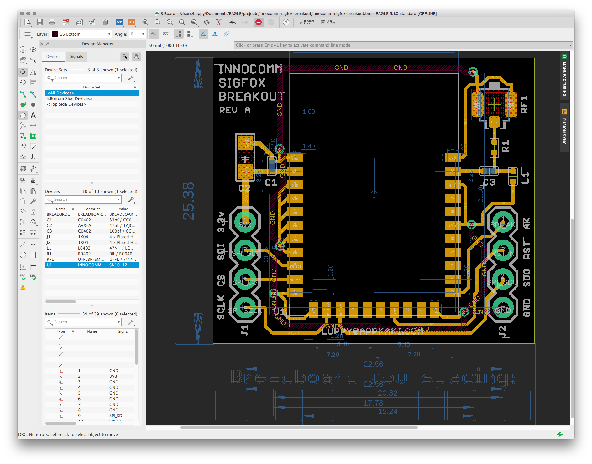

## InnoComm SN10-12 Sigfox Breakout Board

This breakout board connects your Arduino, Raspberry Pi and other devices to the Sigfox IoT network for low-power, long-range communications. The board uses the InnoComm SN10-12 module to connect to the Sigfox network. The interface between the device and the breakout board is based on SPI with 8 pins (3.3V, GND, CS, SDI, SDO, SCLK, AK, RST). A U.FL antenna and a Sigfox network subscription are required.

- Autodesk EAGLE board and schematic for InnoComm SN10-12 Sigfox Breakout board (Sigfox Zones RCZ2 and RCZ4) are in `innocomm-sigfox-breakout.brd` and `innocomm-sigfox-breakout.sch`

- The PCB design uses 2 layers: `Top` (layer 1), `Bottom` (layer 16).

- Formatted for Seeed Fusion PCB Assembly service, so that you may submit the files from this repository and order the breakout board fully assembled with the onboard components, including the InnoComm Sigfox module: <br>
  https://www.seeedstudio.com/fusion.html

- All components sourced from Seeed Open Parts Library (except for InnoComm module) for quicker PCB assembly by Seeed Fusion: <br>
  https://www.seeedstudio.com/opl.html

- Seeed Open Parts Library for Autodesk EAGLE: (only for the components used) <br>
  `Seeed-Capacitor.lbr` <br>
  `Seeed-Connector.lbr` <br>
  `Seeed-Inductor.lbr` <br>
  `Seeed-Resistor.lbr`
  
- SparkFun Library for Autodesk EAGLE was used for general symbols and components: <br>
  `SparkFun-Aesthetics.lbr` <br>
  `SparkFun-Boards.lbr` <br>
  `SparkFun-Connectors.lbr` <br>
  `SparkFun-PowerSymbols.lbr` <br>

- PCB layout was validated in Autodesk EAGLE with the Seeed Fusion Design Rules `SeeedStudio_2layer_DRU_no_angle_20140221.dru`

- PCB design was exported from Autodesk EAGLE to Seeed Fusion in Gerber RS-274X and Excellon (drill) formats using the CAM Processor Job `Seeed_Gerber_Generater_2-layer.cam`. To export:

  1. In EAGLE Board Editor, click `File → CAM Processor`

  1. At the top of the `CAM Processor` window, click the `Load Job File` icon.  Click `New CAM Job`.

  1. Click `Open CAM File`. Select `Seeed_Gerber_Generater_2-layer.cam`.

  1. Click `Export As ZIP`

  1. Under `Gerber → Options → Output Type`, select `Gerber RS-274X`.

  1. Click `Process Job`.  This creates a ZIP file that may be uploaded directly to Seeed Fusion.

- To export the Bill Of Materials (BOM) for uploading to Seeed Fusion: 

  1. In EAGLE Board Editor, click `File → Export Partlist`. Enter `partlist.csv` as the filename.

  1. We will use the first 2 columns of `partlist.csv`: <br>
      `Part:` Contains the `Designator` e.g. `C1`<br>
      `Value:` Contains 3 values - `Description` / `Manufacturer Part Number` / `SKU` (i.e. the Seeed Open Parts Library SKU number) like this: `33pf / CC0402JRNPO9BN330 / 302010000` <br>

  1. Open the file `innocomm-sigfox-breakout-bom.csv` in Excel. Populate the 3 columns:
      `Designator`, `Manufacturer Part Number`, `Quantity` like this:
      ```
      Designator,Manufacturer Part Number,Quantity
      C1,CC0402JRNPO9BN330,1
      C2,TAJC476K006RNJ,1
      U1,SN10-12,1
      ...
      ```
      We will provide a URL for Seeed Fusion to source for the InnoComm SN10-12 module.

  1. Save the CSV file for uploading to Seeed Fusion.  Check `innocomm-sigfox-breakout-bom.csv` for the BOM that I have submitted to Seeed Fusion.

## Seeed Fusion PCB Manufacturing and Assembly

Order submitted to Seeed Fusion for PCB manufacturing and assembly at https://www.seeedstudio.com/fusion_pcb.html:

1. `innocomm-sigfox-breakout_YYYY-MM-DD.zip`: PCB design in Gerber RS-274X and Excellon (drill) formats

1. PCB Specifications:

    |     |               |       |
    | ---:| ------------- | ----- |
    | 1.  | Base Material | `FR-4 TG130` |
    | 3.  | No. of Layers | `2 layers` |
    | 2.  | PCB Dimensions | `25.4 mm * 28.5mm` |
    | 4.  | PCB Quantity | _(Enter quantity)_ |
    | 5.  | No. of Different Designs | `1` |
    | 6.  | PCB Thickness | `1.6` |
    | 7.  | PCB Color | `Green` |
    | 8.  | Surface Finish | `HASL` |
    | 9.  | Minimum Solder Mask Dam | `0.1mm` |
    | 10. | Copper Weight | `1oz.` |
    | 11. | Minimum Drill Hole Size | `0.3mm` <br> (In EAGLE Board Editor, click <br> `Tools → Statistics → Drill / Hole → VIA Drill`) |
    | 12. | Trace Width / Spacing | `4/4 mil` <br> (In EAGLE Board Editor, click <br> `Tools → Statistics → Board → Minor → Wire Width`) |
    | 13. | Blind or Buried Vias | `No` |
    | 14. | Plated Half-holes / Castellated Holes | `No` |
    | 15. | Impedance Control | `No` |

1. `innocomm-sigfox-breakout-bom.csv`: PCB Assembly Bill Of Materials (BOM) for Sigfox Zones RCZ4 and RCZ4<br>

1. Link provided to Seeed Fusion for sourcing InnoComm SN10-12: <br>																									
    `https://www.arrow.com/zh-cn/products/sn10-12/innocomm-mobile-technology-corporation`

## References

1. Original PCB design for Wisol Sigfox Breakout Board: <br>
  https://github.com/lupyuen/Wisol-WSSFM10R-Sigfox-Breakout/tree/master/Hardware
  
1. Why I created the breakout board: <br>
  https://medium.com/@ly.lee/making-my-first-ever-pcb-with-seeed-fusion-pcb-assembly-service-9af5736016b3
  
1. List of all Sigfox Zones and the countries covered: <br>
  http://makers.sigfox.com/about/

1. _"InnoComm SN10-12 SIGFOX Module Product Specification"_: Available from InnoComm website upon registration.

1. _"Wisol WSSFM10R H/W Design Guide"_: For ESD protection circuit. Available from Wisol website upon registration.


